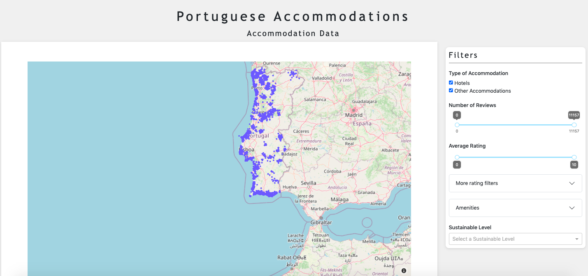

# Notebook: Dash.ipynb

This notebook contains the dashboard code for Accommodation data.

## Sections:
	1. Importing all Necessary Libraries (pandas, plotly.express, dash, dash_core_components, dash_html_components, dash_bootstrap_components)
	2. Importing Data
	3. Dash code

## Dashboard Preview

